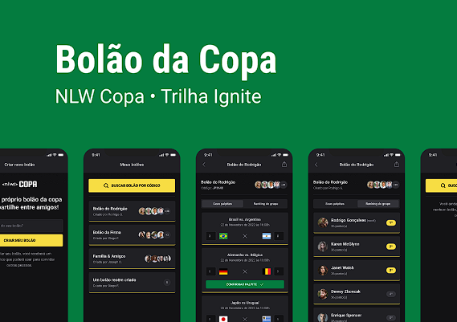

# NWL - Copa 2022 Full stack application

This project is part of 10th edition of Rocketseat NWL program.

**Project Structure**
- Mobile
  - Expo and React Native Mobile application
- Server
  - NodeJS and Fastify Backend Application
- Web
  - NextJS Application



## Requirements

  - Yarn, Npm or Pnpm package manager
    - Recommended: **Yarn**
  - NodeJS
  - Node: v18+

## Mobile

Add your appliciation configuration to your .env file in the root of mobile project. It requires you to generate a AUTH2 credentials in (https://console.cloud.google.com/apis/credentials)[google cloud console].

```
GOOGLE_CLIENT_ID=YOUR_API_KEY
```

in the mobile project folder, install the dependencies

```
yarn install
``` 

Running the project

```
yarn start or expo start 
```

## Web

Write it Later.

## Server

Write it Later.